Lab 09: Algorithmic Bias
================
Lilly McClendon
04.10.2025

## Load Necessary Packages

First, let’s load the necessary packages:

``` r
library(tidyverse)
library(janitor)
library(fairness)
```

## Load the Data

``` r
compas <- read_csv("data/compas-scores-2-years.csv") %>%
  clean_names() %>%
  rename(decile_score = decile_score_12, 
         priors_count = priors_count_15)
```

    ## New names:
    ## Rows: 7214 Columns: 53
    ## ── Column specification
    ## ──────────────────────────────────────────────────────── Delimiter: "," chr
    ## (19): name, first, last, sex, age_cat, race, c_case_number, c_charge_de... dbl
    ## (19): id, age, juv_fel_count, decile_score...12, juv_misd_count, juv_ot... lgl
    ## (1): violent_recid dttm (2): c_jail_in, c_jail_out date (12):
    ## compas_screening_date, dob, c_offense_date, c_arrest_date, r_offe...
    ## ℹ Use `spec()` to retrieve the full column specification for this data. ℹ
    ## Specify the column types or set `show_col_types = FALSE` to quiet this message.
    ## • `decile_score` -> `decile_score...12`
    ## • `priors_count` -> `priors_count...15`
    ## • `decile_score` -> `decile_score...40`
    ## • `priors_count` -> `priors_count...49`

``` r
glimpse(compas)
```

    ## Rows: 7,214
    ## Columns: 53
    ## $ id                      <dbl> 1, 3, 4, 5, 6, 7, 8, 9, 10, 13, 14, 15, 16, 18…
    ## $ name                    <chr> "miguel hernandez", "kevon dixon", "ed philo",…
    ## $ first                   <chr> "miguel", "kevon", "ed", "marcu", "bouthy", "m…
    ## $ last                    <chr> "hernandez", "dixon", "philo", "brown", "pierr…
    ## $ compas_screening_date   <date> 2013-08-14, 2013-01-27, 2013-04-14, 2013-01-1…
    ## $ sex                     <chr> "Male", "Male", "Male", "Male", "Male", "Male"…
    ## $ dob                     <date> 1947-04-18, 1982-01-22, 1991-05-14, 1993-01-2…
    ## $ age                     <dbl> 69, 34, 24, 23, 43, 44, 41, 43, 39, 21, 27, 23…
    ## $ age_cat                 <chr> "Greater than 45", "25 - 45", "Less than 25", …
    ## $ race                    <chr> "Other", "African-American", "African-American…
    ## $ juv_fel_count           <dbl> 0, 0, 0, 0, 0, 0, 0, 0, 0, 0, 0, 0, 0, 0, 0, 0…
    ## $ decile_score            <dbl> 1, 3, 4, 8, 1, 1, 6, 4, 1, 3, 4, 6, 1, 4, 1, 3…
    ## $ juv_misd_count          <dbl> 0, 0, 0, 1, 0, 0, 0, 0, 0, 0, 0, 0, 0, 0, 0, 0…
    ## $ juv_other_count         <dbl> 0, 0, 1, 0, 0, 0, 0, 0, 0, 0, 0, 0, 0, 0, 0, 0…
    ## $ priors_count            <dbl> 0, 0, 4, 1, 2, 0, 14, 3, 0, 1, 0, 3, 0, 0, 1, …
    ## $ days_b_screening_arrest <dbl> -1, -1, -1, NA, NA, 0, -1, -1, -1, 428, -1, 0,…
    ## $ c_jail_in               <dttm> 2013-08-13 06:03:42, 2013-01-26 03:45:27, 201…
    ## $ c_jail_out              <dttm> 2013-08-14 05:41:20, 2013-02-05 05:36:53, 201…
    ## $ c_case_number           <chr> "13011352CF10A", "13001275CF10A", "13005330CF1…
    ## $ c_offense_date          <date> 2013-08-13, 2013-01-26, 2013-04-13, 2013-01-1…
    ## $ c_arrest_date           <date> NA, NA, NA, NA, 2013-01-09, NA, NA, 2013-08-2…
    ## $ c_days_from_compas      <dbl> 1, 1, 1, 1, 76, 0, 1, 1, 1, 308, 1, 0, 0, 1, 4…
    ## $ c_charge_degree         <chr> "F", "F", "F", "F", "F", "M", "F", "F", "M", "…
    ## $ c_charge_desc           <chr> "Aggravated Assault w/Firearm", "Felony Batter…
    ## $ is_recid                <dbl> 0, 1, 1, 0, 0, 0, 1, 0, 0, 1, 0, 1, 0, 0, 1, 1…
    ## $ r_case_number           <chr> NA, "13009779CF10A", "13011511MM10A", NA, NA, …
    ## $ r_charge_degree         <chr> NA, "(F3)", "(M1)", NA, NA, NA, "(F2)", NA, NA…
    ## $ r_days_from_arrest      <dbl> NA, NA, 0, NA, NA, NA, 0, NA, NA, 0, NA, NA, N…
    ## $ r_offense_date          <date> NA, 2013-07-05, 2013-06-16, NA, NA, NA, 2014-…
    ## $ r_charge_desc           <chr> NA, "Felony Battery (Dom Strang)", "Driving Un…
    ## $ r_jail_in               <date> NA, NA, 2013-06-16, NA, NA, NA, 2014-03-31, N…
    ## $ r_jail_out              <date> NA, NA, 2013-06-16, NA, NA, NA, 2014-04-18, N…
    ## $ violent_recid           <lgl> NA, NA, NA, NA, NA, NA, NA, NA, NA, NA, NA, NA…
    ## $ is_violent_recid        <dbl> 0, 1, 0, 0, 0, 0, 0, 0, 0, 1, 0, 0, 0, 0, 0, 0…
    ## $ vr_case_number          <chr> NA, "13009779CF10A", NA, NA, NA, NA, NA, NA, N…
    ## $ vr_charge_degree        <chr> NA, "(F3)", NA, NA, NA, NA, NA, NA, NA, "(F2)"…
    ## $ vr_offense_date         <date> NA, 2013-07-05, NA, NA, NA, NA, NA, NA, NA, 2…
    ## $ vr_charge_desc          <chr> NA, "Felony Battery (Dom Strang)", NA, NA, NA,…
    ## $ type_of_assessment      <chr> "Risk of Recidivism", "Risk of Recidivism", "R…
    ## $ decile_score_40         <dbl> 1, 3, 4, 8, 1, 1, 6, 4, 1, 3, 4, 6, 1, 4, 1, 3…
    ## $ score_text              <chr> "Low", "Low", "Low", "High", "Low", "Low", "Me…
    ## $ screening_date          <date> 2013-08-14, 2013-01-27, 2013-04-14, 2013-01-1…
    ## $ v_type_of_assessment    <chr> "Risk of Violence", "Risk of Violence", "Risk …
    ## $ v_decile_score          <dbl> 1, 1, 3, 6, 1, 1, 2, 3, 1, 5, 4, 4, 1, 2, 1, 2…
    ## $ v_score_text            <chr> "Low", "Low", "Low", "Medium", "Low", "Low", "…
    ## $ v_screening_date        <date> 2013-08-14, 2013-01-27, 2013-04-14, 2013-01-1…
    ## $ in_custody              <date> 2014-07-07, 2013-01-26, 2013-06-16, NA, NA, 2…
    ## $ out_custody             <date> 2014-07-14, 2013-02-05, 2013-06-16, NA, NA, 2…
    ## $ priors_count_49         <dbl> 0, 0, 4, 1, 2, 0, 14, 3, 0, 1, 0, 3, 0, 0, 1, …
    ## $ start                   <dbl> 0, 9, 0, 0, 0, 1, 5, 0, 2, 0, 0, 4, 1, 0, 0, 0…
    ## $ end                     <dbl> 327, 159, 63, 1174, 1102, 853, 40, 265, 747, 4…
    ## $ event                   <dbl> 0, 1, 0, 0, 0, 0, 1, 0, 0, 1, 0, 1, 0, 0, 1, 1…
    ## $ two_year_recid          <dbl> 0, 1, 1, 0, 0, 0, 1, 0, 0, 1, 0, 1, 0, 0, 1, 1…

# Part 1: Exploring the data

## Exercise 1

``` r
nrow(compas)
```

    ## [1] 7214

``` r
ncol(compas)
```

    ## [1] 53

The dimensions of the data set are 7214 x 53. There are 7214 rows of
data. Each row in the data set represents a criminal defendant. The
variables in this data set are id, first name, last name, the date they
were compas screened, sex, birthday, age, age range, race, juvenile
felony count, decile score, juvenile misdemeanor count, juvenile other
count, priors count, how many days prior to screening the defendant was
arrested, the date they went into jail for the compas screening, the
date they left jail for the compas screening, their case number for the
compas screening, arrest date for the compas screening, days from
compas, the degree of their charge for the compas screening, a
description of their charge for the compas screening, is recidivism,
their case number for the recidivism case, the degree of their charge
for the recidivism case, the days from arrest for the recidivism case,
their offense date of the recidivism case, a description of their charge
for the recidivism case, the date they entered jail for the recidivism
case, the date they left jail for the recidivism case. There are also
variables for violent recidivism, if violent recidivism occurred and
coded, violent recidivism case number, violent recidivism charge degree,
violent recidivism offense date, description of violent recidivism
charge. There are variables for the type of assessment, the decile
score, an interpretation of the decile score, date of screening,
violence type assessment, violence decile score, violence score in text,
violence screening date, date in custody, date left custody, prior
counts, start, end, eent, and two-year recidivism.

## Exercise 2

``` r
library(dplyr)
distinct(compas, name)
```

    ## # A tibble: 7,158 × 1
    ##    name              
    ##    <chr>             
    ##  1 miguel hernandez  
    ##  2 kevon dixon       
    ##  3 ed philo          
    ##  4 marcu brown       
    ##  5 bouthy pierrelouis
    ##  6 marsha miles      
    ##  7 edward riddle     
    ##  8 steven stewart    
    ##  9 elizabeth thieme  
    ## 10 bo bradac         
    ## # ℹ 7,148 more rows

There are 7,158 unique names in the compas data set. It may be that
there are fewer unique defendants in the data set because there are
defendants who have committed another crime and were screened again, or
that some defendants could share a name.

## Exercise 3

``` r
library(ggplot2)
ggplot(compas, aes(x=decile_score)) + 
  geom_histogram(binwidth = .5) + 
  scale_x_continuous(breaks = seq(0,13,1))
```

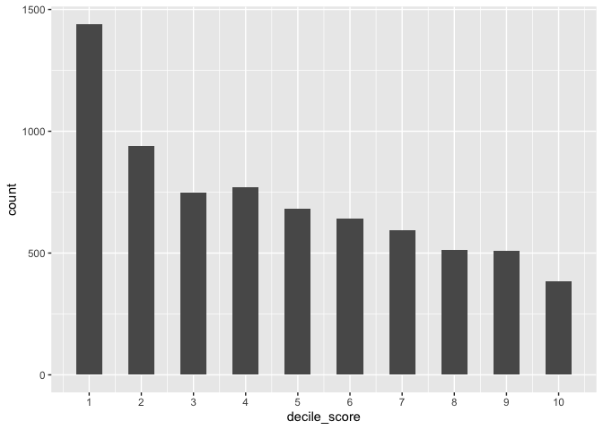<!-- -->

The distribution is a unimodal and positively skewed (right-skewed).The
most common decile_score is 1.

## Exercise 4

``` r
library(ggplot2)
ggplot(compas, aes(x=race)) + 
  geom_bar(aes(x=forcats::fct_infreq(race))) + 
  theme(axis.text.x = element_text(angle = 20, vjust = .5))
```

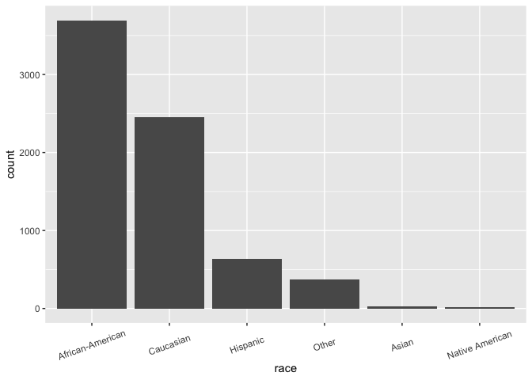<!-- -->

``` r
library(ggplot2)
ggplot(compas, aes(x=sex)) + 
  geom_bar(aes(x=forcats::fct_infreq(sex)))
```

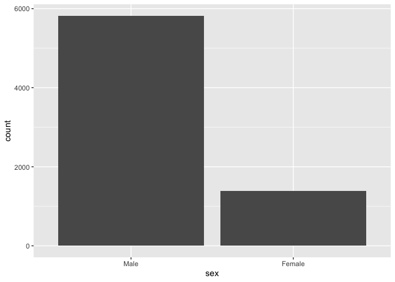<!-- -->

``` r
library(ggplot2)
ggplot(compas, aes(x=age_cat)) +
  geom_bar()
```

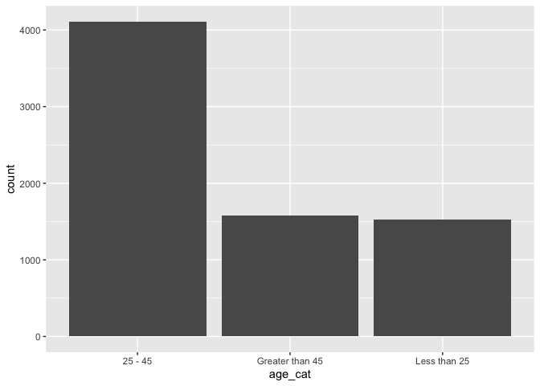<!-- -->

``` r
library(ggplot2)
library(tidyverse)

agecat_compas <- subset(compas, select=c("age_cat"))

agecat_compas$age_cat <- factor(agecat_compas$age_cat, levels = c ("Less than 25", "25 - 45", "Greater than 45"))

ggplot(agecat_compas, aes(x=age_cat)) + 
  geom_bar() + 
  labs(x="Age Category", y = "Count")
```

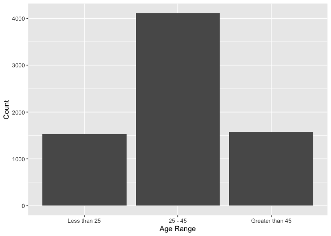<!-- -->

# Part 2: Risk scores and recidivism

## Exercise 5

``` r
library(ggplot2)

ggplot(compas, aes(x=decile_score, fill=factor(two_year_recid))) + 
  geom_histogram(binwidth = .5) +
  scale_x_continuous(breaks = seq(0,13,1)) + 
  scale_fill_discrete("Two Year Recidivism", labels = c("Did not recidivate", "Did recidivate"))
```

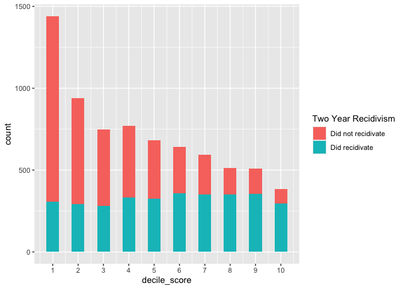<!-- -->

Based on this visualization, it seems that there is a slightly number of
defendants who did recidivate in the higher decile scores than the lower
decile scores.

## Exercise 6

``` r
library(dplyr)

accuracy_compas <- compas %>% 
  mutate(accuracy = case_when(
    decile_score >=7 & two_year_recid == 1 ~ 3, 
    decile_score <= 4 & two_year_recid == 0 ~ 3, 
    TRUE ~ 8
  ))

accuracy_compas %>% 
  count(accuracy, name = "count")
```

    ## # A tibble: 2 × 2
    ##   accuracy count
    ##      <dbl> <int>
    ## 1        3  4032
    ## 2        8  3182

``` r
(4032 / 7214) * 100
```

    ## [1] 55.89132

``` r
accuracy_compas
```

    ## # A tibble: 7,214 × 54
    ##       id name   first last  compas_screening_date sex   dob          age age_cat
    ##    <dbl> <chr>  <chr> <chr> <date>                <chr> <date>     <dbl> <chr>  
    ##  1     1 migue… migu… hern… 2013-08-14            Male  1947-04-18    69 Greate…
    ##  2     3 kevon… kevon dixon 2013-01-27            Male  1982-01-22    34 25 - 45
    ##  3     4 ed ph… ed    philo 2013-04-14            Male  1991-05-14    24 Less t…
    ##  4     5 marcu… marcu brown 2013-01-13            Male  1993-01-21    23 Less t…
    ##  5     6 bouth… bout… pier… 2013-03-26            Male  1973-01-22    43 25 - 45
    ##  6     7 marsh… mars… miles 2013-11-30            Male  1971-08-22    44 25 - 45
    ##  7     8 edwar… edwa… ridd… 2014-02-19            Male  1974-07-23    41 25 - 45
    ##  8     9 steve… stev… stew… 2013-08-30            Male  1973-02-25    43 25 - 45
    ##  9    10 eliza… eliz… thie… 2014-03-16            Fema… 1976-06-03    39 25 - 45
    ## 10    13 bo br… bo    brad… 2013-11-04            Male  1994-06-10    21 Less t…
    ## # ℹ 7,204 more rows
    ## # ℹ 45 more variables: race <chr>, juv_fel_count <dbl>, decile_score <dbl>,
    ## #   juv_misd_count <dbl>, juv_other_count <dbl>, priors_count <dbl>,
    ## #   days_b_screening_arrest <dbl>, c_jail_in <dttm>, c_jail_out <dttm>,
    ## #   c_case_number <chr>, c_offense_date <date>, c_arrest_date <date>,
    ## #   c_days_from_compas <dbl>, c_charge_degree <chr>, c_charge_desc <chr>,
    ## #   is_recid <dbl>, r_case_number <chr>, r_charge_degree <chr>, …

## Exercise 7

Overall, I calculated the accuracy of the COMPAS algorithm as 55.89%.
This is not a formula that performs very well as it is barely over 50%
accurate, meaning that it is better than chance, but not by much.

# Part 3 Risk scores and recidivism

## Exercise 8

``` r
library(ggplot2)
library(dplyr)

race_compas <- compas %>%
  filter(race %in% c("African-American", "Caucasian"))
  
ggplot(race_compas, aes(x=decile_score, fill = race)) + 
  geom_histogram(binwidth = .5) + 
  scale_x_continuous(breaks = seq(0,13,1)) + 
  facet_wrap(~race)
```

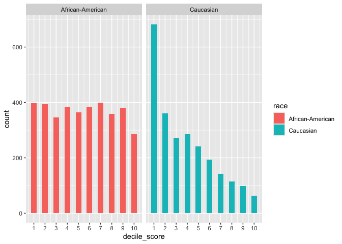<!-- -->

The visualization for Caucasian defendants is right-skewed (positively
skewed) meaning that there is a greater number of defendants with lower
decile scores. The visualization for African-American defendants is
unform indicating that the number of defendants with each decile score
is approximately even. Additionally, there are quite a few more
African-American defendants with high decile scores compared to the
number of Caucasian defendants with high decile scores.

## Exercise 9

``` r
library(dplyr)

AA_defendants <- compas %>% 
  filter(race %in% c("African-American"))
count(AA_defendants)
```

    ## # A tibble: 1 × 1
    ##       n
    ##   <int>
    ## 1  3696

``` r
sum(AA_defendants$decile_score >= 7)
```

    ## [1] 1425

``` r
sum(AA_defendants$decile_score <= 6)
```

    ## [1] 2271

``` r
(1425/3696)*100
```

    ## [1] 38.55519

``` r
C_defendants <- compas %>% 
  filter(race %in% c("Caucasian"))
count(C_defendants)
```

    ## # A tibble: 1 × 1
    ##       n
    ##   <int>
    ## 1  2454

``` r
sum(C_defendants$decile_score >= 7)
```

    ## [1] 419

``` r
sum(C_defendants$decile_score <= 6)
```

    ## [1] 2035

``` r
(419/2454)*100
```

    ## [1] 17.07416

There is a disparity in the percentage of African-American defendants
and Caucasian defendants who were classified as high risk (decile_score
\>= 7). 38.56% of African-American defendants were classified as high
risk while 17.07% of Caucasian defendants were classified as high risk.

## Exercise 10

``` r
non_recidivists <- compas %>%
  filter(two_year_recid == 0)

recidivists <- compas %>%
  filter(two_year_recid == 1)

high_risk_non_recidivists <- non_recidivists %>% 
  filter(decile_score>=7)

low_risk_non_recidivists <- non_recidivists %>% 
  filter(decile_score<=4)

high_risk_recidivists <- recidivists %>% 
  filter(decile_score>=7)

low_risk_recidivists <- recidivists %>% 
  filter(decile_score<=4)

sum(non_recidivists$race == "African-American")
```

    ## [1] 1795

``` r
sum(high_risk_non_recidivists$race == "African-American")
```

    ## [1] 447

``` r
(447/1795)*100
```

    ## [1] 24.90251

``` r
sum(non_recidivists$race == "Caucasian")
```

    ## [1] 1488

``` r
sum(high_risk_non_recidivists$race == "Caucasian")
```

    ## [1] 136

``` r
(136/1488)*100
```

    ## [1] 9.139785

``` r
sum(recidivists$race == "African-American")
```

    ## [1] 1901

``` r
sum(low_risk_recidivists$race == "African-American")
```

    ## [1] 532

``` r
(531/1901)*100
```

    ## [1] 27.93267

``` r
sum(recidivists$race == "Caucasian")
```

    ## [1] 966

``` r
sum(low_risk_recidivists$race == "Caucasian")
```

    ## [1] 461

``` r
(461/966)*100
```

    ## [1] 47.72257

False Positive Rate - African-Americans = 24.90%

False Positive Rate - Caucasians = 9.14%

False Negative Rate - African-Americans = 27.93%

False Negative Rate - Caucasians = 47.72 %

A false positive indicates that they thought the defendant would
recidivate but they did not, while a false negative indicates that they
thought the defendant would not recidivate, but the defendent did
recidivate.

## Exercise 11

``` r
Misclassifications <- data.frame(
  stringsAsFactors = FALSE, 
  race = c("African-American", "Caucasian"),
  false_positive = c(24.90, 9.14), 
  false_negative = c(27.93, 47.72)
)

ggplot(Misclassifications, aes(x=race, y=false_positive, fill = race)) +
  geom_col() + 
  labs(title = "False Positive Rate by Race", y = "False Positive Rate (Percentage)")
```

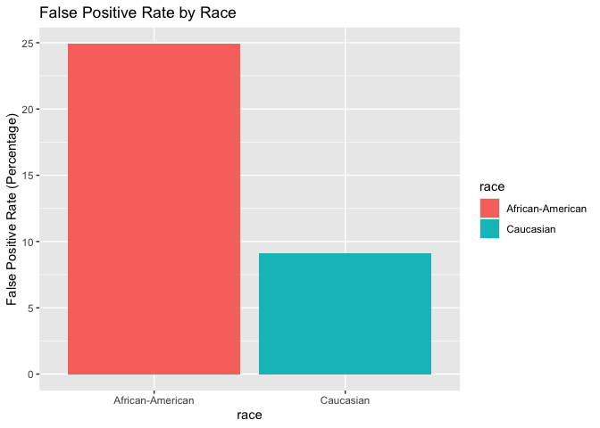<!-- -->

``` r
ggplot(Misclassifications, aes(x=race, y=false_negative, fill = race)) +
  geom_col() + 
  labs(title = "False Negative Rate by Race", y = "False Negative Rate (Percentage)")
```

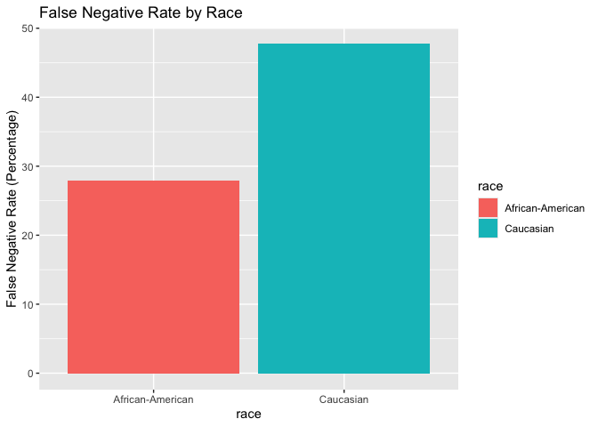<!-- -->

In the visualization with false positive rate there is much higher
percentage among African-American defendants compared to Caucasian
defendants and in the visualization with false negative rate, there is a
much higher percentage among Caucasian defendants. This is problematic
because a higher false negative rate indicates that among defendants who
do not recidivate, African-American defendants are more likely to be
categorized as high risk. A high false negative rate indicates that
among defendants who do recidivate, Caucasian defendants are more likely
to be categorized as low risk. The false positive and false negative
rates show that African-American defendents are more likely to be
erroneously classified as high risk and less likely to be erroneously
classified as low risk.

# Part 4: Understanding the sources of bias

## Exercise 12

``` r
library(ggplot2)

ggplot(compas, aes(fill=race, y=priors_count, x=decile_score)) + 
  geom_bar(position="stack", stat="identity") + 
  scale_x_continuous(breaks = seq(0,13,1)) 
```

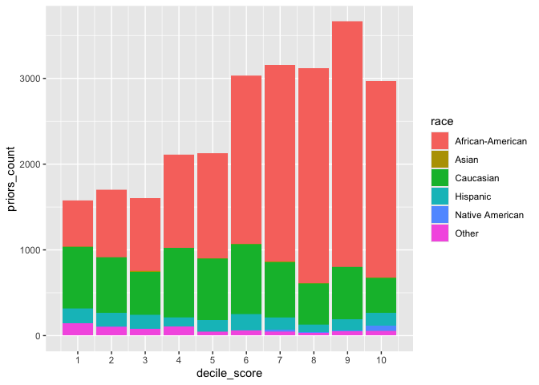<!-- -->

``` r
ggplot(compas, aes(fill=race, y=priors_count, x=decile_score)) + 
  geom_bar(position="dodge", stat="identity")
```

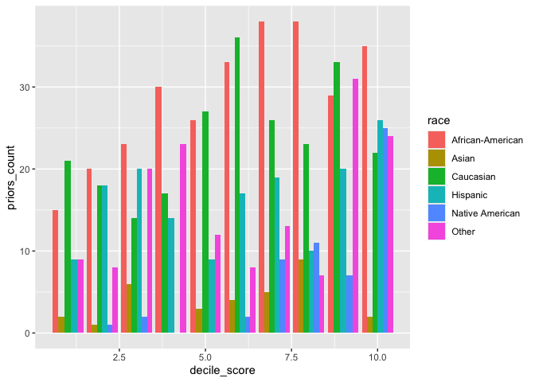<!-- -->

The algorithm appears to weigh prior convictions more heavily for
African-Americans than other races.

## Exercise 13

I see some evidence that supports ProPublica’s claim that the algorithm
is biased.When examining false positive rates and false negative rates,
there is some obvious differences between African American defendants
and Caucasian defendants. African American defendants have a higher rate
of false positives than Caucasian defendants. This can be thought of as
“false alarms” and in such it indicates that African-Americans at a
higher rate than Caucasians are categorized as high risk when they do
not go on to recidivate. Additionally, African-American defendants have
a lower false negative rate than Caucasian defendants. This indicates
that African-American defendants who go on to recidivate are less likely
to be categorized as low risk.

# Part 5: Designing fairer algorithms

## Exercise 14

I would work on trying to lower the biased type I and type II errors
that disproportionately affect African-American defendants. I would try
to filter for recent offenses rather than just any prior offense, and
maybe take age into account. I would also try to reweigh some of the
factors to see if that could help to reduce some of the bias.

## Exercise 15

When designing a “fair” algorithm, some trade offs may be that there is
an inability to manage any biases that go into the data collected which
will then be transferred to the results of the algorithm. Additionally,
it may be hard to account for nuances about prior convictions etc.

## Exercise 16

There should not be reliance solely on alrogirthms. Judgement should be
used when there are algorithms. Algorithms do not always account for
other factors like mental health, etc.
